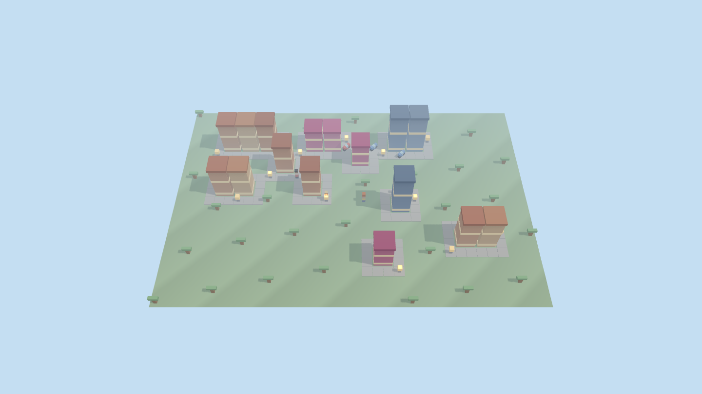
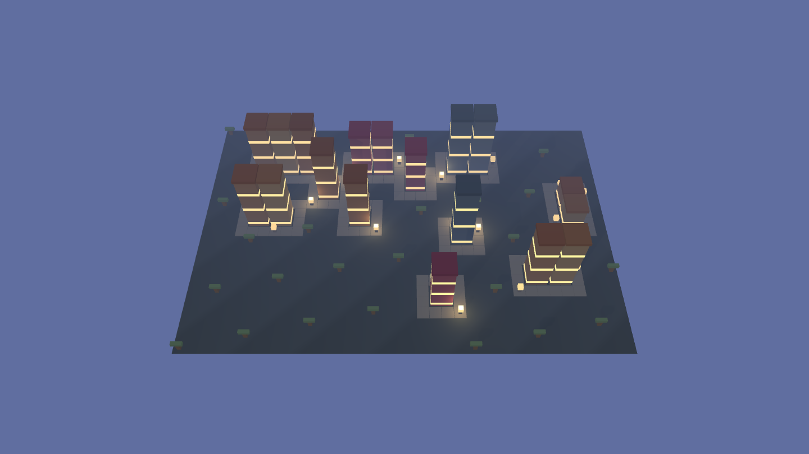

# MiniTown

🎮 **[Play online / Jugar online](https://mauricioperera.github.io/MiniTown/)** · runs in the browser, no install.

**English** — A cozy voxel city-sim that plays more like a contemplative god game than a management game: place Residential/Shop/Workspace zones on empty land, roads appear around them on their own, buildings rise through visible construction stages, and the town comes alive — named residents with homes, jobs and schedules walk (or drive) its streets as day turns to night. All content and balance is data ([`game/GAME.md`](game/GAME.md), [GAME Protocol](https://github.com/MauricioPerera/game-protocol)); every module was built against hash-sealed frozen tests on a [KDD](https://github.com/MauricioPerera/KDD) template instance. Version history: [CHANGELOG.md](CHANGELOG.md).

<a id="español"></a>

## Español

Un **city-sim cozy de vóxeles** — más god game contemplativo que juego de gestión. Colocás zonas en un terreno vacío, los caminos aparecen solos, los edificios se construyen a la vista, y el pueblo cobra vida: gente con nombre, casa, trabajo y horario que camina (o maneja) por sus calles mientras el día se vuelve noche.

| Mañana | Noche |
|---|---|
|  |  |

## Cómo se juega

- **Explorar (E)** — modo por defecto: el mouse no coloca nada; movete y mirá.
- **Zonas** — `1` casa · `2` tienda · `3` taller (o los botones). **Click y arrastre** coloca un bloque de **1 a 3 edificios pegados**: los caminos rodean el exterior del bloque, nunca pasan por adentro.
- **Cámara** — WASD/flechas para paneo, rueda para zoom, arrastre con botón derecho.
- **Inspección** — pasá el mouse sobre cualquier edificio: quiénes están adentro y qué hace cada uno (durmiendo, trabajando, comprando...), y el stock en los edificios de economía.
- **Gestión** — panel de política (⚖): fijás la **tasa de impuestos** (el ingreso principal del pueblo) y mirás el medidor de **atractividad** — bienes en los mercados, empleo disponible e impuestos razonables atraen; una ciudad cara y desabastecida espanta. Los ciudadanos **llegan gradualmente** si la ciudad atrae (y se van si no), y más población significa más recaudación: farmear → abastecer → atraer → recaudar → crecer.
- **Clima** — lluvia y nieve deterministas que cambian el pueblo de verdad: la lluvia riega (las granjas producen más rápido) y suena; la nieve pausa los cultivos, frena a los peatones y blanquea el pueblo hasta derretirse. El clima persiste en el guardado.
- **Sonido** — ambiente cozy 100% sintetizado (sin assets): pájaros de día, grillos de noche, viento y un pad suave que siguen el reloj del pueblo, más campanitas pentatónicas al colocar, terminar obras y vender. Botón de altavoz para silenciar (se recuerda tu elección).
- **Economía** — `4` granja · `5` almacén · `6` mercado. Colocar zonas cuesta monedas (HUD de dinero): las granjas producen a la vista (el campo se llena de cultivos), los carritos reparten granja → almacén → mercado **solo si hay conexión vial**, y cada compra de un vecino en el mercado paga al tesoro. Farmear financia el crecimiento del pueblo.

Los edificios pasan por **losa → esqueleto → terminado**, se habitan, y suben de nivel con el tiempo. Cada residente tiene rutina propia (tres plantillas de horario), camina por los caminos con costo preferente, y **usa el auto** cuando el trayecto vial es largo. De noche el ambiente se enfría y las ventanas ocupadas y farolas emiten luz cálida.

## Correr local

Cualquier server estático sirve (Three.js llega por CDN, no hay build ni npm):

```bash
python -m http.server 8321
# abrir http://localhost:8321/game/minitown.html
```

## Todo es dato: GAME.md

El juego sigue el [Protocolo GAME](https://github.com/MauricioPerera/game-protocol) (*gameplay as data*): el contenido y el balance completos viven en [`game/GAME.md`](game/GAME.md) — colores y vóxeles de gente/autos/árboles, variantes de edificios, etapas de obra, paleta día/noche, horarios, velocidades, textos y nombres — validados por el perfil propio [`minitown`](game/profiles/minitown.js) (que compone al perfil `voxel`) y compilados al artefacto que consume el motor:

```bash
node game/tools/game-lint.js game/GAME.md      # validar (0 errores / 0 warnings)
node game/tools/game-export.js game/GAME.md game/game-data.generated.js   # regenerar
```

Cambiar el balance del juego (¿días más largos? ¿más residentes por casa? ¿otra paleta?) es editar YAML, no tocar código.

Los **edificios también son dato**: la colección `buildingModels` de `GAME.md` define, por kind y por nivel, modelos voxel con estilo (structures) que el motor elige de forma determinista y dibuja escalados al lote — hoy vienen dos estilos residenciales (`terracota` y `nordica`), y si un kind no trae modelos cae al edificio procedural intacto. Para modelar los tuyos sin escribir YAML a mano está el **editor voxel** integrado ([`game/voxel-editor.html`](game/voxel-editor.html)): paleta desde los materiales del juego, importás prefabs y exportás las líneas listas para pegar. Cómo generar edificios y props paso a paso: [`docs/generar-elementos.md`](docs/generar-elementos.md).

Los datos están **sellados** (`dataSha256` en el frontmatter, game-protocol ≥ v2.19): el lint detecta cualquier edición no re-sellada. Tras un cambio legítimo: `node game/tools/game-seal.js game/GAME.md` y actualizar el token.

## Estructura

| Ruta | Qué es |
|---|---|
| [`game/minitown.html`](game/minitown.html) | El juego (shell + UI). |
| [`game/src/sim-core.mjs`](game/src/sim-core.mjs) | Simulación pura: zonas, bloques por drag, caminos automáticos, obra, crecimiento. |
| [`game/src/agents.mjs`](game/src/agents.mjs) | Residentes: rutinas, pathfinding (Dijkstra), autos, empleos y compras. |
| [`game/src/economy.mjs`](game/src/economy.mjs) | Economía: carritos de reparto por caminos, ventas y tesoro. |
| [`game/src/render-core.mjs`](game/src/render-core.mjs) | Lógica de presentación pura: paleta día/noche, visual de edificios, cámara. |
| [`game/src/render.mjs`](game/src/render.mjs) | Escena Three.js: instancias voxel, luces, hover, HUD. |
| [`game/GAME.md`](game/GAME.md) + [`game/profiles/minitown.js`](game/profiles/minitown.js) | Datos + perfil de validación. |
| [`game/voxel-editor.html`](game/voxel-editor.html) | Editor voxel 3D: modelás con los materiales del juego y exportás líneas YAML listas para GAME.md. |
| [`game/src/editor-core.mjs`](game/src/editor-core.mjs) | Núcleo puro del editor: mapa de celdas, normalización e import/export de prefabs. |
| [`game/concepts/`](game/concepts/) | Conceptos visuales previos al desarrollo (página interactiva). |
| [`knowledge/contracts/`](knowledge/contracts/) | Contratos de tarea con tests congelados sellados por hash. |
| [`docs/screenshots/`](docs/screenshots/) · [`docs/concepts/`](docs/concepts/) | Capturas del juego y de los conceptos. |

## Verificación

Cada módulo se implementó contra **tests congelados** (oráculo escrito antes que el código, sellado por hash en su contrato):

```bash
node --test tests/game/*.mjs                                 # 42 tests del juego
python scripts/validate_contracts.py knowledge/contracts     # contratos + sellos
python -m unittest discover -s tests                         # suite del tooling KDD
```

## Metodología

Repo instanciado del template **[KDD](https://github.com/MauricioPerera/KDD)** (Knowledge-Driven Development: OKF + CCDD). Cada tarea fue un contrato con definición de hecho ejecutable; la implementación la hicieron agentes de IA efímeros contra ese oráculo, y el veredicto lo dio el gate determinista — no la opinión de nadie. Las reglas para agentes están en [`.agents/AGENTS.md`](.agents/AGENTS.md). Historial de versiones en [CHANGELOG.md](CHANGELOG.md).

## Licencia

[MIT](LICENSE).
